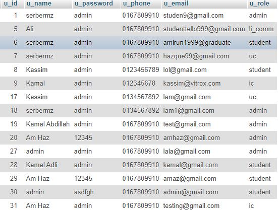

# ITS
0. Unzip the zip file (Good job, you've already done it).
1. Import database using its(1).sql that contains together beside ITS folder and unzipper.php
2. Check file conn.php in the ITS directory to set up the database according to the user's configuration.
	2.1: By default, this is the configuration
	       $servername = "localhost"; //Can be changed
	       $username = "root";  //can be changed
	       $password = "mysql"; //can be changed
	       $DBname = "its"; //follow db name in its(1).sql or change the name at there
3. Check internet connection, since some of the file requires internet connection to run (Mostly don't, just for precaution)
4. Check credential in table `user` in `its` database
5. Make sure you're in correct directory before proceed to test the system.
No security effort is applied. So, kindly no SQL injection, XSS attack.
Thank you!!
---------------------------------------------------------------
-----------------------------------------------------------------
CREDENTIAL
`admin` = admin /n
`li_comm` = li committee /n
`student` = student /n
`uc` = university coach
`ic` = industry coach

---------------------------------------------------------------------
---------------------------------------------------------------------
ADMIN PART:
credential:
username:studen9@gmail.com	password:admin

1. Create account module:
This is for creating `user` only (Make sure email used in create student and create user is same for email).
Use `Create Student` to create student. Use short email only.. cannot exceeded 25 characters

2. Industry Insert/ Update:
Use to edit company information.
You can only edit before create. 
Use same email that being used to create `user` for ic or `Industry Coach` when create the account for company.

3. Upload LI:
Upload LI info
the info will being shown to student module.
File will being saved on 1_Admin/li

4. Log System
Using manual simle SQL query to enter and not using TRIGGER

5. Create Student
For student to properly used the system, need to create student and user account first.

-------------------------------------------------------------
-----------------------------------------------------------------
LI COMMITTEE:
username:studenttello999@gmail.com		password:admin

1. DASHBOARD:
Simple text information using GROUP BY

2. ASSIGN UNI COACH:
Can only assign one at a time.
Update means set new coach, Delete means reset the selection.
Using datalist, so need to clear the search bar, before use the list to assigning coach

3. REPORT (not fully done):
//TODO

4. STUDENT PROGRESS
Check student industry coach and uni coach and course

5. SEND EMAIL:
Using a href="mailto:" and not SMTP
Will open the user email provider such as MS Outlook

--------------------------------------------------------------------------
----------------------------------------------------------------------------
STUDENT:
Approved Industry Coach:
username:amirun1999@lol.my	password:admin

Not Approved Yet Industry Coach:
username:first@gmail.com		password:admin

1.LI Info
Download LI Info
and play with zooming scale when check the pdf viewer if not shown anything

2. LIST Company
List of company to apply.
If in process or already got the industry coach, no buton will appear

If not a blue button will appear, and message will being send to Industry Coach for approval.

3. PROFILE:
Use submit button to submit everything including uploaded picture.
Kindly upload file with .JPG <---    only           not even .JPEG XXXXX

4. UPLOAD RESUME:
Upload resume
File will be saved in 3_Student/resume/

5. UPLOAD TECHNICAL:
Upload technical report
will be saved in 3_Student/technical/

can delete also if not approved by coach. (UI not good though)
Status indicator:
0: Not checked yet
1: Approved
-1: Rejected

6. LOGBOOK
Set date, title, and content

Can delete also if not approved by coaches.

-----------------------------------------------------------------------------------------------------------------------------
-----------------------------------------------------------------------------------------------------------------------------
UNIVERSITY COACH:
username:lam@gmail.com		password:admin
1. VIEW STUDENT
View basic student info and resume.
Click on resume to view.

2. VIEW INTERN
View student info that assigned to uni coach

3. VIEW REPORT
View student report if any and can approve or reject it.
Use search bar to filter status report:
Keywords:
Not check
Approve
Reject

4. VIEW INTERN  ASSESSMENT(old module) && INTERN  ASSESSMENT(new module)
Set the marks for each module.                        || Send assessment form -> put into DB

5. VIEW INTERN LOGBOOK
If no logbook sent by intern, no data will be available.
Approve and reject logbook.
Use search bar to filter status report and date:
Keywords:
Not check
Approve
Reject
Click blue button to view status

6. EXIT SURVEY
simple survey to send to DB.

------------------------------------------------------------------------
-------------------------------------------------------------------------

INDUSTRY COACH:
username:dosm@gmail.com		password:admin
1. VIEW STUDENT
View basic student info and resume.
Click on resume to view.

2. VIEW INTERN
View student info that assigned to uni coach

3. VIEW REPORT
View student report if any and can approve or reject it.
Use search bar to filter status report:
Keywords:
Not check
Approve
Reject

4. VIEW INTERN  ASSESSMENT(old module) && INTERN  ASSESSMENT(new module)
Set the marks for each module.                        || Send assessment form -> put into DB

5. VIEW INTERN LOGBOOK
If no logbook sent by intern, no data will be available.
Approve and reject logbook.
Use search bar to filter status report and date:
Keywords:
Not check
Approve
Reject
Click blue button to view status

6. EXIT SURVEY
simple survey to send to DB.

7. APPROVE STUDENT
approve/ reject student that apply 
if reject, student can see blue button for Apply again
if not, no more blue button

CONTACT if have any question:
amirun A18CS0109 -> 016-7809910

